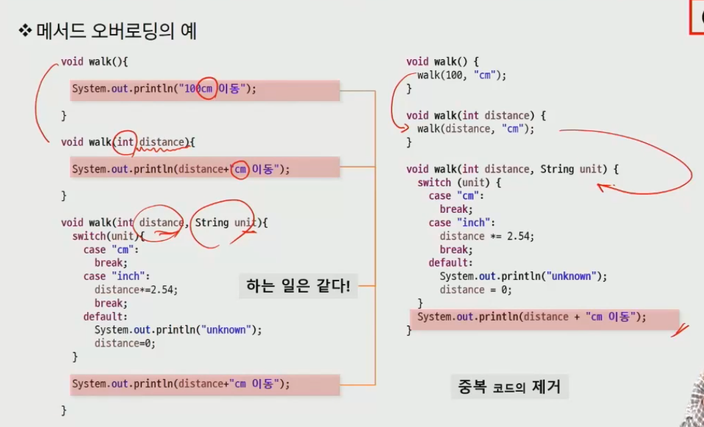

# Java

[TOC]

## Day 1

## Java기본문법 - 변수와 타입


### 운영체제와 프로그램

* `운영체제(Operating System, OS)`: 시스템 하드웨어 관리 및 응용 소프트웨어 실행을 위해 하드웨어 추상화 플랫폼과 공통 시스템 서비스를 제공하는 시스템 소프트웨어

* `프로그램` : 컴퓨터에서 실행될 때 특정 작업을 수행하는 일련의 명령어들의 모음
* `JVM` : 자바 바이트코드를 실행할 수 있는 주체
  * 자바 바이트코드는 플랫폼에 독립적이며 모든 자바 가상 머신은 자바 가상 머신 규격에 정의된대로 실행


### 컴퓨터의 자료 표현

**메모리의 단위**

* 비트 (bit) : 0 or 1
* 바이트 (Byte) : 8biy
* 2진수 (Binary)


### 메인 메소드

* 실행 명령인 자바를 실행시 가장 먼저 호출되는 부분,
* 만약 Application에서 main()메소드가 없다면 실행 시킬 수 없다.

##### 질문(String[] args는 뭘까요?)

```java
public static void main(String[] args){}
```


### 출력문

* `print` : 괄호안 내용을 단순히 출력. 개행문자(=줄바꿈문자=\n) 포함안됨.
* `printf` : C에서의 printf와 동일. %d, %s 등을 쓰기위해 사용. 개행문자 포함X
  * %d : 정수, %f : 실수 , %c : 문자, %s : 문자열
* `println` : 출력 후 줄 바꿈 (개행문자 포함)


### 변수(variable)

* ##### 정의 : 데이터를 저장할 메모리의 위치를 나타내는 이름

  * 메모리 상에 데이터를 보관할 수 있는 공간을 확보

 * `선언` : 자료형 변수명;

 * `초기화` : 변수명 = 저장할 값;

 * `선언 & 초기화 동시에` : 자료형 변수명 = 저장할 값;

```java
int age; 		String name;
age = 30;		name = '철수';
int age = 30;	String name = '철수';
```

##### 	* 주의할 점

​	대소문자 구분, 공백 x, 숫자로 시작x, 예약어 x, `$`,`_`를 제외한 특수문자 x


### 자료형 (data type)

* 기본 자료형
* 참조 자료형

| 표현 형태 | 데이터타입 |    크기     |      표현범위       |
| :-------: | :--------: | :---------: | :-----------------: |
|  논릿값   |  boolean   | 1bit만 사용 |   true 또는 false   |
| 단일 문자 |    char    |    2byte    | '\u0000' - '\uffff' |
|   정수    |    byte    |    1byte    |     -128 ~ 127      |
|   정수    |   short    |    2byte    |   -2^15 ~ 2^15-1    |
|   정수    | int (기본) |    4byte    |   -2^31 ~ 2^31-1    |
|   정수    |    long    |    8byte    |   -2^63 ~ 2^63-1    |
|   실수    |   float    |    4byte    |                     |
|   실수    |   double   |    8byte    |                     |

자료형의 크기 비교

```bash
byte < short < int < long < float < double
	   char < int < long < float < double
```


### 데이터 타입의 변환

* 변수의 타입을 다른 타입으로 변경
* `Promotion (묵시적 형변환)` : 작은 데이터 타입 => 큰 데이터 타입
  * 데이터 손실의 우려가 없어 자동 캐스팅
  * 형변환 현산자를 사용하지 않아도 자동으로 형변환이 이루어 지는 경우
* `Demotion (명시적 형변환)` : 큰 데이터 타입 => 작은 데이터 타입

  * 데이터 손실의 우려로 명시적 캐스팅
* 데이터 타입이 축소되어 변환된 후에도 **해당 값을 표현**할 수 있어야 함


### 자바 연산자 (기본 문법)

* 산술연산자
  * 정수형, 실수형에 사용됨
    * 단항 연산자: ++, == (++3, 3++)
    * 다항 연산자: +, =, *, /, %
* 비교연산자
  * 대소비교, 타입비교
  * True or False를 반환
    * \>, >=, <, <=, ==, !=, instanceof (객체 타입의 비교)

* 논리연산자
  * boolean 데이터 타입에 적용
  * True or False 반환
    * &, &&, |, ||, !
    * && : 값 1이 False인 경우 값 2를 수행하지 않고 False 리턴
    * || : 값 1이 True인 경우 값 2를 수행하지 않고 True 리턴

* 배정 연산자
  * += , -=, *=, /= 


#### 제어문 (조건문)

* if 문:

```java
if (조건식1) {		// 조건식 자리는 반드시 참과 거짓 구분
    실행문장;
} else if (조건식2) {		// 문장이 여러개일 때는 블록처리 해주어야 한다.  
    실행문장;
} else {	      // else절은 필요에 따라
    실행문장
}
```


* switch 문:

```java
switch (수식) {
    case 값1:
        처리문장들;
        break;	// break 없으면 찾을 때까지 선택된 case문 아래의 모든 문장을 실행
    case 값2:
        처리문장들;
        break;	
    default: 	// else와 같은 역할
        묵시적으로 처리해야하는 문장들;
}
```

* continue
  * 반복문의 특정지점에서 제어를 반복문의 처음으로 보낸다.

```java
class ContinueTest{
    public static void main(String args[]){
        for(int i=0;i<10;i++){
            if(i%2==0) continue;
            System.out.println(i+"자바의 세계로 오세요!");
        }
    }
}
```


### 배열

- **같은 종류의 데이터**를 저장하기 위한 자료구조
- **크기 고정** (한번 생성된 배열은 크기를 바꿀 수 없다.)
- 배열을 객체로 취급

* `선언`: 타입 [] 배열이름
* `생성`
  * `1차원 배열` : 배열의 이름 = new 배열유형 [배열크기];
  * `2차원 배열` : 배열의 이름 = new 배열유형\[1차원 배열개수\]\[*1차원배열의크기\];
* 자동 초기화 : 배열이 생성되면 자동적으로 배열 요소는 기본값으로 초기화

* `초기화` : 배열이름[인덱스]*[인덱스] = 값;
  * 배열의 인덱스는 0부터 시작
  * 배열의 크기: 배열이름.length
  * {}를 활용 할 수 있다.

##### 질문 (두개가 뭐가 다른거냐?)

```java
// 배열의 선언
int [] iArr; // 하나의 값을 저장할 수 있는 메모리 생성
int [][] aptInfoList; //하나의 값을 저장할 수 있는 메모리 생성

// 배열의 생성
int[] iArr = new int[3]
int[][] aptInfoList = new int[3][2];

// 배열의 초기화 new사용
// 1. new 배열타입[]{값} 
int[] iArr = new int[3]{1,2};
int[][] aptInfoList = new int[3][2]{1,3,2};

// {}활용 (배열 선언시에만 사용)
// 2. 배열유형 [] 배열명 = {}
int[] prime = {1,2,3};
```


#### 배열 관련 제공 API

```java
System.arraycopy(src, srcPos, dest, destPos, length);
//원본배열, 복사시작위치, 복사할 배열, 복사받을 시작위치, 복사할 크기
Arrays.toString(객체);
//배열안의 요소를 [요소, 요소, 요소] 형태로 출력
```


#### 배열의 메모리 생성과정

```java
int[] points = new int[3];
// 배열 선언: 
int[] points;				// 공간 1개 null값

// 배열 생성 :
new int[3];				 	// 메모리에 연속된 공간 차지 => 크기 변경 불가 
							// int type의 데이터 3개를 담을 수 있는 메모리 공간 확보
							// Type에 대한 default값으로 자동 초기화
points = new int[3];		// !!배열의 주소를 변수에 할당!!하여 참조하게 한다.
							// 0x100이 메모리 주소
// 요소에 값 할당:
points[0] = 1;
points[1] = 'A';
```

##### 질문! **int[] intArray = {3, 27, 13, 8, 235, 7, 22, 9, 435, 31, 54} 이때는 어떻게 메모리 할당?**


#### for-each

* 가독성이 개선된 반복문으로 배열 및 Collections에서 사용
* index 대신 직접 요소(elements)에 접근하는 변수를 제공
* read only


##### 최대값 최소값 찾기

```java
public class maxmin{
    public static void main(String[] args) {
        int[] intArray = {3, 27, 13, 8, 235, 7, 22, 9, 435, 31, 54};

        int min = 1000;
        int max = 0;
        for(int num: intArray) {
            if(num>max){
                max = num;
            }
            if(num<min){
                min = num;
            }
        }
        System.out.printf("min: %d, max: %d%n", min, max);
    
    }
}
```


##### 최대값 최소값 찾기 2

```java
public class maxmin2 {
    public static void main(String[] args) {
        int[] intArray = {3, 27, 13, 8, 235, 7, 22, 9, 435, 31, 54};
        int min = Integer.MAX_VALUE;
        int max = Integer.MIN_VALUE;

        for (int num : intArray){
            min = Math.min(min, num);
            max = Math.max(max, num);
        }
        System.out.println("min: "+min+ " max: "+max);
    }
}
```


#####  요소의 빈도 카운팅

```java
import java.util.Arrays;

public class counting {
    public static void main(String[] args) {
        int[] intArray = {3, 7, 2, 5, 7, 7, 9, 2, 8, 1, 1, 5, 3};
        int[] used = new int[10];

        for(int num:intArray) {
            used[num]++;
        }
        
        System.out.println(Arrays.toString(used));
    }
}
```


#### 2차원 배열 메모리

```java
int a = 10;

int[] arr = new int[4];

int[][] arr2 = new int[2][];
arr2[0] = new int[3];
arr2[1] = new int[3];
arr2[1][1] = 100
```


##### 2차원 배열 탐색

```java
// 모든 2차원 배열의 원소 중 3의 배수의 개수와 그들의 합을 출력
public class twodarray{
    public static void main(String[] args) {
        int[][] grid = {
            {2, 3, 1, 4, 7}, {8, 13, 3, 33, 1},
            {7, 4, 5, 80, 12}, {17, 9, 11, 5, 4},
            {4, 5, 91, 27, 7}
        };
        int count = 0;
        int sum = 0;
        for(int[] row: grid){
            for (int num:row){
                if (num%3 == 0){
                    count++;
                    sum += num;
                }
            }
        }
        System.out.println("개수: "+count+" 총합: " + sum);
    }
}
```


### 클래스 (Class)

* 관련 있는 변수와 함수를 묶어서 만든 사용자 정의 <자료형>

* 모든 객체들의 생산처 
* 클래스 = 객체를 생성하는 틀
* 각 객체들이 어떤 특징(속성과 동작)을 가지고 있을지 결정한다.
* 객체들 사이에서 메시지를 주고 받도록 만들어준다.


#### 객체의 구성

* `속성(Attribute)` : 멤버 변수

  `int channel;`, `int volumn;` etc

* `동작 (Behavior)` : 메소드

  `public void channelUp(){}`

* 추상화 : 필요한 객체를 설계해서 프로그램이 인식하게 하는 방법
  * 클래스 설계, 객체 생성 => 객체는 클래스에서 정의한 속성과 동작을 가지고 동작한다.


#### 클래스의 선언

```java
[접근제한자][활용제한자] class 클래스명 {
    속성 정의 (멤버 변수);
    기능 정의 (메소드);      
}
// 접근 제한자 : public / default
// 활용 제한자 : final / abstract
```

```python
객체 (object/instance)와 인스턴스 변수
```


#### 메소드 (Method)

* 객체가 할 수 있는 행동을 정의
* 메소드의 이름은 소문자로 시작하는 것이 관례

```java
[접근제한자][활용제한자] 반환값 메소드이름([매개변수들]){ 
    행위 기술 ...
}
// 접근 제한자 : public / protected / default() / private
// 활용 제한자 : static / final / abstract / synchronized
public static void main(String[] a){}
```

리턴 타입 설정: 아무것도 반환하지 않을 때는 void

여러 타입의 결과를 반환할 때는 객체로 묶어서 반환

VariableArgs(몇개를 받을지 모를때) int...

##### 선언

* 선언시 {} 안에 메소드가 해야 할 일을 정의

```java
class Test{
	public void call(int val){
    	해야 할 일 정의;
    }
}
```


##### 호출

* 호출한 메소드가 선언되어 있는 클래스를 접근한다.
* 클래스 객체.메소드 이름으로 호출

```java
Test t = new Test(); 	// 객체 생성
t.call(100);			// 메서드 호출
```


| 비고        | static member                               | non static member(instance member) |
| ----------- | ------------------------------------------- | ---------------------------------- |
| 소속        | 클래스 (클래스 올라갈때 메모리 위에 올라감) | 객체                               |
| 같은 클래스 | 바로 호출                                   | 바로 호출                          |
| 다른 클래스 | 클래스\_이름.멤버_이름                      | 객체_이름.멤버\_이름               |

class 멤버와 instance 멤버간의 참조와 호출

* 가장 중요한 것은 메모리에 있는가?
  * 메모리에 있으면 호출가능
  * 메모리에 없으면 호출 불가
* static member => 언제나 메모리에 있다.
  * class 로딩시 자동으로 등록한다.
* instance member => 객체 생성 전에는 메모리에 없다.
  * 객체 생성시 모든 일반 멤버들은 메모리에 생성된다.
  * 객체 즉 레퍼런스를 통해서 접근한다.

* 메서드 호출 스택
  * First in Last out의 구조 
* 기본형 변수와 참조형 변수
  * 메서드 호출 시 파라미터로 입력된 값을 복사해서 전달한다. => 기본형 변수 (원본은 변하지 않는다.)
  * Java는 call by Value


```java
class Test{
    public static void call(){
	    해야할 일;
    }
}

Test t = new Test();
t.call();
Test.call();
```


`매개변수 (parameter)` : 메소드에서 사용하는 것

`인자(arguments)` : 호출하는 쪽에서 전달하는 것

* 메소드에서 받은 매개변수는 그 메소드에서 선언한 지역변수와 똑같이 간주

* 메소드에 매개변수가 있으면 반드시 해당 유형의 값을 전달해야만 한다.

* 메소드로부터 값을 받을 수도 있다.

* 리턴 유형은 메소드를 선언할 때 지정

  

```java
public int getVolumn(){  // int로 리턴값 선언
    return 10
}
int volumn = getVolumn();
```


* 메소드에 여러개의 인자를 전달할 수 있다.

* 메소드에는 값이 전달되는 방식을 사용합니다.

```java
public void init(int channel, int volumn){
	// channel 이랑 volumn 들어옴
}
```

* 여러 개의 값을 리턴하고 싶다면 배열을 이용 (Collection 객체를 이용)
* 무조건 리턴 할 필요 없음


##### 메서드 오버로딩

* `overloading`: 동일한 기능을 수행하는 메서드의 추가작성
  * 메서드 이름을 통일하고 input타입에 따라 다르게 작동
  * ex) eat <= eatUsingChopsticks, eatUsingFork, eatUsingSpoon
  * ex) println
  * 기얼해야할 메서드가 감소하고 중복 코드에 대한 효율적 관리 가능
  * 메서드 이름은 동일하고 파라미터의 개수 또는 순서 타입이 달라야한다.




#### 생성자

1. 클래스 명과 이름이 동일

2. 반환 타입이 없다.

```java
public class Dog{
	Dog(){
        System.out.println("나는 생성자 입니다.");
        System.out.println("클래스와 이름이 동일하고 반환타입이 없어요.");
    }
}
```

3. 디폴트 생성자

   * 클래스 내에 생성자가 하나도 정의되어 있지 않을경우 JVM에서 자동으로 제공

   ```java
   class Dog{
       Dog() {
           
       }
   }
   ```

4. 오버로딩 지원
   * 클래스 내에 메소드 이름이 같고 매개변수의 타입 또는 개수가 다른 것

```java
class Dog{
    Dog(){}
    Dog(String name){}
    Dog(int age){}
    Dog(String name, int age){}
}

class Main{
    public static void main(String[] a){
        Dog d = new Dog();
        Dog d2 = new Dog("쫑");
        Dog d3 = new Dog(3);
        Dog d4 = new Dog("메리", 4);
    }
}
```

5. 객체를 생성할 때 속성의 초기화를 담당하게 한다.

```java
class Dog{
    Dog(){}
    String name;
    int age;
    Dog(String n, int a){
        name = n;
        age = a;
    }
}

class Main{
    public static void main(String[] a){
        Dog d = new Dog();
        d.name = "쫑";
        d.age = 3;
        Dog d2 = new Dog("메리",4);
        System.out.println(d.name + d.age);
    }
}
```

6. this의 활용 (static 영역에서는 사용이 불가능하다.)
   * this.멤버변수
   * this([인자값..]) : 생성자 호출
     * 주의사항 : 생성자 내에서만 호출 가능, 첫번재 구문에 위치해야함 

```java
class Dog{
    String name;
    int age;
    Dog(){
        //Dog("쫑"); => 오류 발생
        this("쫑");
    }
    Dog(String name)
}
```


#####  문제 1

```java
class ExDate{
    String year;
    String month;
    String day;
    ExDate(){
        year = "2021";
        month = "4";
        day = "01";
    }

    ExDate(int y, int m, int d){
        year = Integer.toString(y);
        month = Integer.toString(m);
        day = Integer.toString(d);
    }

    void showDate(){
        System.out.println(this.year +"년 "+ this.month+"월 "+ this.day+"일");

    }
}
public class ExDateMain{
    public static void main(String[] args) {
        ExDate ex01 =  new ExDate();
        ex01.showDate();
        ExDate ex02 = new ExDate(2021, 8, 11);
        ex02.showDate();
       
    }
}
```


##### 문제 2

```java
class Dog{
    String name = "이름모름";
    int age = 0;

    Dog(){}
    Dog(String n){
        name = n;
    }
    Dog(int a){
        age = a;
    }
    Dog(String n, int a){
        name = n;
        age = a;
    }

    void info(){
        System.out.printf("강아지의 이름은 %s이고 나이는 %d입니다.\n", this.name, this.age);
    }
}

public class DogMain {
    public static void main(String[] args) {
        Dog d = new Dog();
        Dog d2 = new Dog("쫑");
        Dog d3 = new Dog(3);
        Dog d4 = new Dog("메리", 2);

        d.info();
        d2.info();
        d3.info();
        d4.info();
    }
}
```


