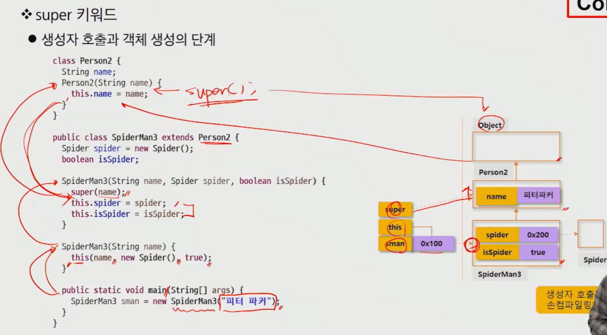
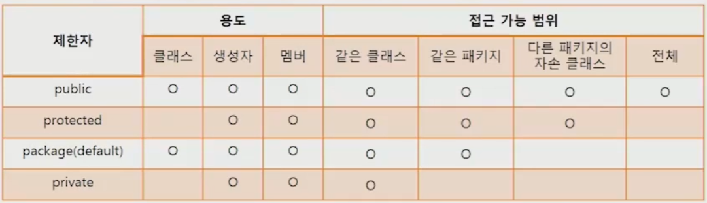

# Java

[TOC]

## Part 01. Java Basic

## Chapter 1. 자바 프로그래밍 언어

### - 자바의 특징

1. 단순하다 (Simple)
   1. 포인터 연산이 없다. (메모리상의 임의의 주소에 액세스 할 수 있는 기능)
   2. 구조체를 사용하지 않는다
   3. 타입 선언을 사용하지 않는다. (클래스가 타입의 의미를 가진다.)
   4. 전처리를 사용하지 않는다.
   5. 다중 상속을 허용하지 않는다. (인터페이스라는 개념으로 제공한다.)
   6. String 클래스를 제공한다
   7. 메모리 할당과 회수 시스템을 제공한다
   8. 예외처리 기능을 제공한다.
2. 객체지향 (Object Oriented)
   * 인터페이스를 명확히 정의하여 재사용 가능한 코드를 만들 수 있다.
3. 네트워크 기반(Network-Savvy)
   * TCP/IP 프로토콜을 처리하는 많은 라이브러리를 제공하낟.
4. 견고하다(Robust)
5. 안전하다
6. 아키텍처로부터 독립
7. 이식성
8. 고성능
9. 다중 쓰레드
10. 동적 결합

### - Java Virtual Machine

* `JVM` : 자바 바이트 코드를 실행 할 수 있는 주체


## Chapter 2. 자바 프로그래밍 입문

### Main Method

* `메인 메소드` : 실행 명령인 java를 실행 시 가장 먼저 호출 되는 부분
  * if main() 메소드가 없다면 실행 될 수 없음.
  * Application의 시작 = 특정 클래스의 main()실행

```java
public static void main(String[] args){
    
}
```


### 출력문

* `print` :
* `println` :
* `printf` : %d, %f, %c, %s


### 변수(variable)

* ##### 정의 : 데이터를 저장할 메모리의 위치를 나타내는 이름

  * 메모리 상에 데이터를 보관할 수 있는 공간을 확보

 * `선언` : 자료형 변수명;
 * `초기화` : 변수명 = 저장할 값;
 * `선언 & 초기화 동시에` : 자료형 변수명 = 저장할 값;

```java
int age; 	String name;
age = 30;	name = '철수';
int age = 30;	String name = '철수';
```

##### 	* 주의할 점

​	대소문자 구분, 공백 x, 숫자로 시작x, 예약어 x

### Class

* 자바 프로그램의 최소 구성 단위
* 선언된 클래스 내부에 실행에 필요한 변수나 메서드 등의 정의 ({} 내에 작성)


### java application

* 바이트 코드로 번역된 후에 바로 실행할 수 있는 일반 프로그램
* 클래스 내에 java라는 명령어로 프로그램을 실행할 때, 자동으로 호풀되어 프로그램을 시작하는 main() 메서드를 가지고 있어야함

```java
public class JavaApp{
    // 변수 선언
    // 메서드 선언
    public static void main(String args[]){
        // 실행될 프로그램 코드
        System.out.println("첫번째로 작성한 자바 프로그램")
    }
}
```


### Data Type

| 표현 형태 | 데이터타입 |    크기     |      표현범위       |
| :-------: | :--------: | :---------: | :-----------------: |
|  논릿값   |  boolean   | 1bit만 사용 |   true 또는 false   |
| 단일 문자 |    char    |    2byte    | '\u0000' - '\uffff' |
|   정수    |    byte    |    1byte    |     -128 ~ 127      |
|   정수    |   short    |    2byte    |   -2^15 ~ 2^15-1    |
|   정수    | int (기본) |    4byte    |   -2^31 ~ 2^31-1    |
|   정수    |    long    |    8byte    |   -2^63 ~ 2^63-1    |
|   실수    |   float    |    4byte    |                     |
|   실수    |   double   |    8byte    |                     |

* 데이터 타입의 범위를 초과하는 값을 저장하면 컴파일시 오류 발생


### 데이터 타입의 변환

* 변수의 타입을 다른 타입으로 변경
* `Promotion (묵시적 형변환)` : 작은 데이터 타입 => 큰 데이터 타입
  * 데이터 손실의 우려가 없어 자동 캐스팅
  * 형변환 현산자를 사용하지 않아도 자동으로 형변환이 이루어 지는 경우
* `Demotion (명시적 형변환)` : 큰 데이터 타입 => 작은 데이터 타입

  * 데이터 손실의 우려로 명시적 캐스팅
* 데이터 타입이 축소되어 변환된 후에도 **해당 값을 표현**할 수 있어야 함


### 자바 연산자 (기본 문법)

* 산술연산자
  * 정수형, 실수형에 사용됨
    * 단항 연산자: ++, == (++3, 3++)
    * 다항 연산자: +, =, *, /, %
* 비교연산자
  * 대소비교, 타입비교
  * True or False를 반환
    * \>, >=, <, <=, ==, !=, instanceof

* 논리연산자
  * boolean 데이터 타입에 적용
  * True or False 반환
    * &, &&, |, ||, !
    * && : 값 1이 False인 경우 값 2를 수행하지 않고 False 리턴
    * || : 값 1이 True인 경우 값 2를 수행하지 않고 True 리턴


### 제어문 (조건문)

* if 문:

```java
if (조건식1) {		// 조건식 자리는 반드시 참과 거짓 구분
    실행문장;
} else if (조건식2) {		// 문장이 여러개일 때는 블록처리 해주어야 한다.  
    실행문장;
} else {	      // else절은 필요에 따라
    실행문장
}
```


* switch 문:

```java
switch (수식) {
    case 값1:
        처리문장들;
        break;	// break 없으면 찾을 때 가지 선택된 case문 아래의 모든 문장을 실행
    case 값2:
        처리문장들;
        break;	
    default: 	// else와 같은 역할
        묵시적으로 처리해야하는 문장들;
}
```


### 제어문 (반복문)

* for 문:

```java
for (초기값;조건;증감){
    반복할 문장들;
}
반복문 빠져나옴;
```


* while 문: 조건이 참인동안 반복

```java
while(조건절){
    반복문장들;
}
```


* do ~ while 문: 일단 do 블럭 내의 문장 실행 후 조건이 참이면 반복

```java
do {
    반복할 문장들
} while(조건절);
```


* break:
  * switch문에서 벗어나는데 사용
  * 반복문에서 반복 루프를 벗어나는데 사용
  * 중접된 반복문에서 반복문을 한번에 빠져나갈때 사용

```java
int i = 1;
while(i<100){
    if(i==10)break;
    System.out.print(i+"자바의 세계로 오세요!");
    i++;
}
```

```java
int i,j;
for(i=1;i<=5;i++){
    for(j=1;j<=i;j++){
        if (j>3) break; // 내포된 반복문만 벗어난다.
        System.out.print("*");
    }
    System.out.println();
}
```

```java
int i,j;
first: for(i=1;i<=5;i++){
    for (j=1;j<=i;j++){
        if (j>3) break first; // first라는 이름의 블록을 벗어난다.
        System.out.print("*");
    }
    System.out.println();
}
```


* continue
  * 반복문의 특정지점에서 제어를 반복문의 처음으로 보낸다.

```java
class ContinueTest{
    public static void main(String args[]){
        for(int i=0;i<10;i++){
            if(i%2==0) continue;
            System.out.println(i+"자바의 세계로 오세요!");
        }
    }
}
```


### 배열

- **같은 종류의 데이터**를 저장하기 위한 자료구조
- **크기 고정** (한번 생성된 배열은 크기를 바꿀 수 없다.)
- 배열을 객체로 취급

* `선언`: 타입 [] 배열이름
* `생성`
  * `1차원 배열` : 배열의 이름 = new 배열유형 [배열크기];
  * `2차원 배열` : 배열의 이름 = new 배열유형\[1차원 배열개수\]\[*1차원배열의크기\];
* 배열이 생성되면 자동적으로 배열 요소는 기본값으로 초기화
* `초기화` : 배열이름[인덱스]*[인덱스] = 값;
  * 배열의 인덱스는 0부터 시작
  * 배열의 크기: 배열이름.length

# 

```java
//배열의 생성
int [] iArr; // 하나의 값을 저장할 수 있는 메모리 생성
int [][] aptInfoList; //하나의 값을 저장할 수 있는 메모리 생성

//배열의 초기화
int[] iArr = new int[3];
```


## Chapter 3. 상속 (Inheritance)

* 상속: 기존 클래스의 자산(멤버, `변수 및 메서드`)을 자식 클래스에서 재사용하기 위한 것
  * 부모의 생성자와 초기화 블록은 상속하지 않는다.
* 기존 클래스의 멤버를 물려 받기 때문에 코드의 절감
  * 부모의 코드를 변경하면 모든 자식들에게도 적용 => 유지 보수성 향상
* 상속의 적용
  * extends 키워드 사용

```java
public class Person{
    String name;
    
    void eat(){}
    void jump(){}
}

public class SpiderMan extends Person{
    boolean isSpider;
    void fireWeb()
}
```


* Object클래스
  * 모든 클래스의 조상클래스
    * 별도의 extends 선언이 없는 클래스들은 extends Object가 생략됨
    * 따라서 모든 클래스에는 Object 클래스에 정의된 메서드가 있음


* 다양한 상속 관계

  * 상속의 관계는 is a 관계라고 함

    * Person is a Object, SpiderMan is a Person  // 하나의 종류이다~

  * Person과 Employee의 관계 => 부모 관계, // 

  * Employee와 SpiderMan의 관계 => 관계 없음(형제 관계가 존재 하지 않는다.)

    

* 단일 상속(Single Inheritance)

  * 다중 상속의 경우 여러 클래스의 기능을 물려 받을 수 있으나 관계가 매우 복잡해짐

    * 동일한 이름의 메서드가 두 부모에게 있다면 자식은 어떤 메서드를 사용할 것인가?

  * 자바는 단일 상속만 지원

    * 대신 interface와 포함 관계(has a)를 사용

      

* 포함관계
  * s상속 이외에 클래스를 재활용 하는 방법
    * 2개 이상의 클래스에서 특정을 가져올 때, 하나는 상속, 나머지는 멤버 변수로 처리
  * 포함 관계의 UML 표현: 실선
  * Spider의 코드를 수정하면 SpiderMan에도 반영되므로 유지 보수성 확보
  * 상속이냐 포함이냐 그것이 문제로다
  * 어떤 클래스를 상속 받고 어떤 클래스를 포함해야하는가?
    * 상속: is a 관계가 성립하는가? =>SpiderMan is a Person
    * 포함: has a 관계가 성립하는가? => SpiderMan has a Spider

```java
public class Person{
    String name;
    
    void eat(){}
    void jump(){
        System.out.prinln("두 다리로 힘껏 점프")
    }
}

public class Spider{
        
    void jump(){
        System.out.println("키*1000만큼 엄청난 점프")
    }
    void fireWeb(){}
}


public class SpiderMan2 extends Person{
	Spider spider = new Spider;
    boolean isSpider;
    
    void fireWeb(){
        if (isSpider){
            spider fireWeb();
        }else{
            System.out.println("Person은 거미줄 발사 불가")
        }
    }
}
```


### 메서드 재정의

* 메서드 오버라이딩(overriding)
  * 조상 클래스에 정의된 메서드를 자식 클래스에서 적합하게 수정하는 것
  * 오버라이딩 조건
    * 메서드 이름이 같아야 한다.
    * 매개 변수의 개수, 타입, 순서가 같아야 한다.
    * 리턴 타입이 같아야 한다.												//메서드 선언부가 같아야한다.
    * 접근 제한자는 부모 보다 범위가 없거나 같아야 한다.
    * 조상보다 더 큰 예외를 던질 수 없다.

```java
public class SpiderMan2 extends Person{
	Spider spider = new Spider;
    boolean isSpider;
    
    void fireWeb(){
        if (isSpider){
            spider fireWeb();
        }else{
            System.out.println("Person은 거미줄 발사 불가")
        }
    }
    
    void jump() {
        if(isSpider){
            spider.jump();
        }else{
            System.out.println("두다리로 힘껏 점프")
        }
    }
}
```


* 정리! OverLoading vs OverRidding
  * Overloading => 같은 메서드에 입력 파라미터 별로 다른 매커니즘 (추가 적재)
  * Overridding => 같은 메서드를 자손 클래스에 적합하게 수정하는 것


* Annotation

  * 사전적 의미: 주석
  * 컴파일러, JVM, 프레임워크 등이 보는 주석
  * 소스 코드에 메타 데이터를 삽입하는 형태 
    * 소스 코드에 붙여 놓은 라밸
    * 코드에 대한 정보 추가 => 소스 코드의 구조 변경, 환경 설정 정보 추가 등의 작업 진행
  * 예시
    * Deprecated: 더 이상 지원하지 않는 메서드가 될 수 있다. (안쓰고 싶게 만듬)
    * Override: 제대로 오버라이드 되었는지 확인해준다.
    * SuppressWarning:  컴파일러에게 사소한 warning의 경우 신경쓰지 말라고 알려줌


#### Object 클래스

* 가장 최상위 클래스로 몸든 클래스의 조상
  * Object의 멤버는 모든 클래스의 멤버


* toString 메서드
  * 객체를 문자열로 변경하는 메서드
  * 정작 궁금한 내용은 주소값이 아닌 내용 => 재정의 해서 사용


* equals 메서드
  * 두 객체가 같은지를 비교하는 메서드
  * 두 개의 레버런스 변수가 같은 객체를 가리키고 있는가? (같은 객체를 참조하고 있는가?)
  * 두 객체의 내용을 비교 할 수 있도록 equals메서드 재정의
    * 객체의 주소 비교: == 활용
    * 객체의 내용 비교: equals 재정의


* hashCode

  * 객체의 해시 코드 : 시스템에서 객체를 구별하기 위해 사용되는 정수 값
  * HashSet, HashMap 등에서 객체의 동일성을 확인하기 위해 사용

  * equals 메서드를 재정의 할 때는 반드시 hashCode도 재정의 할 것

  

* Object의 메서드 재정의


* super 키워드

  * this를 통해 멤버에 접근했듯이 super를 통해 조상 클래스 멤버 접근
    * super.를 통해 조상의 메서드 호출로 조상의 코드 재사용
    * super.super로 가지는 않는다.

  * 변수의 scope
    * 사용된 위치에서 점점 확장해가며 처음 만난 선언부에 연결됨
    * method내부 => 해당 클래스 멤버변수 => 조상 클래스 멤버 변수 

  * this()가 해당 클래스의 다른 생성자를 호출하듯 super()는 조상 클래스의 생성자 호출
    * 조상 클래스에 선언된 멤버들은 조상 클래스의 생성자에서 초기화가 이뤄지므로 이를 재활용
    * 자식 클래스에 선언된 멤버들만 자식 클래스 생성자에서 초기화
  * super()는 자식 클래스 생성자의 맨 첫줄에서만 호출가능
    * 즉 생성자의 첫줄에만 this() 또는 super()가 올 수 있다 
      * 두개 동시에 사용 불가능하다.
  * 명시적으로 this() 또는 super()를 호출하지 않는 경우 컴파일러가 super() 삽입
    * 결론적으로 맨 상위의 Object까지 객체가 다 만들어지는 구조
  * 생성자 호출과 객체 생성의 단계

  ```java
  class Person{
      String name;
      Person(String name){
          this.name = name;
      }
  }
  
  public class SpiderMan extends Person{
      Spider spider = new Spider();
      boolean isSpider;
      
      SpiderMan(String name, Spider spider, boolean isSpider) {
          super(name);
          this.spider = spider;
          this.isSpider = true;
      }
      
      SpiderMan(String name){
          this(name, new Spider(), true);
      }
      
      public static void main(String[] args){
          SpiderMan sman = new SpiderMan("피터파커")
      }
  }
  ```

  




### Package & import

Package

* PC의 많은 파일 관리 => 폴더 이용
  * 유사한 목적의 파일을 기준으로 작성
  * 이름은 의미 있는 이름으로, 계층적 접근
* 프로그램의 많은 클래스 => 패키지 이용
  * 패키지의 이름은 의미 있는 이름으로 만들고 .를 통해 계층적 접근
  * 물리적으로 패키지는 클래스 파일을 담고 있는 디렉터리
* package의 선언
  * package package_name;
  * 주석, 공백을 제외한 첫 번째 문장에 하나의 패키지만 선언
  * 모든 클래스는 반드시 하나의 패키지에 속한다.
    * 생략시 default package
    * default package는 되도록 사용하지 않는다.
* 일반적인 package naming 룰
  * 소속.프로젝트.용도


import

* 다른 패키지에 선언된 클래스를 사용하기 위해 키워드
  * 패키지와 클래스 선언 사이에 위치
  * 패키지와 달리 여러번 선언 가능
* 선언 방법
  * import 패키지명.클래스명
  * import 패키지명.*;
    * 하위 패키지까지 import 하지는 않는다.
* import한 package의 클래스 이름이 동일하여 명확히 구분해야 할 때
  * 클래스 이름 앞에 전체 패키지 명을 입력
* default import package
  * java.lang.*;
  * 단축키 ctrl+shift+O


일반적인 클래스 레이아웃

* 패키지 선언부
* 외부 패키지 import
* class 선언부
* 멤버변수
* 초기화블록
* 생성자
* 멤버 메서드


### 접근 제한자 및 데이터 은닉과 보호

* 제한자
  * 클래스, 변수, 메서드 선언부에 함께 사용되어 부가적인 의미 부여
  * 종류
    * 접근 제한자 : public, protected, (default = package), private
    * 그 외 제한자
      * static: 클래스 레벨의 요소 설정
      * final: 요소를 더 이상 수정할 수 없게 함
      * abstract: 추상 메서드 및 추상 클래스 작성
      * synchronized: 멀티스레드에서의 동기화 처리
    * 하나의 대상에 여러 제한자를 조합 가능하나 접근 제한자는 하나만 사용 가능
    * 순서는 무관
      * 일반적으로 접근 제한자를 맨 앞으로


* final 
  * 마지막, 더 바뀔 수 없음
  * 용도 
    * final class - 더 이상 확장 할 수 없음 : 상속 금지 => 오버라이드 방지 (이미 완벽한 클래스들)
    * final method - 더 이상 재정의 할 수 없음 : overriding 금지 (상속은 가능하다.)
    * final variable - 더 이상 값을 바꿀 수 없음 : 상수화 (ex pi = 3.1415926535)


* 접근 제한자 
  * 멤버 등에 사용되며 해당 요소를 외부에서 사용할 수 있는지 설정
  * method override 조건의 확인
    * 부모의 제한자 범위와 같거나 넓은 범위로만 사용 가능



* 데이터 은닉과 보호 (Encapsulation E)
  * 누군가 당신의 정보를 마음대로 바꾼다면?
* 보호 받지 못하는 이유 
  * 외부에서 변수에 직접 접근하기 때문
* 정보를 보호하기 위한 대책은
  * 변수는 private 접근으로 막기
  * 공개되는 메서드를 통한 접근 통로 마련: setter / getter
    * 메서드에 정보 보호 로직 작성


* 객체의 생성 제어와 Singleton 디자인 패턴

  * 객체의 생성을 제한해야 한다면?

    * 여러개의 객체가 필요 없는 경우
      * 객체를 구별할 필요가 없는 경우 = 수정 가능한 멤버 변수가 없고 기능만 있는 경우
      * 이런 객체를 stateless 한 객체라고 한다.
    * 객체를 계속 생성/삭제 하는데 많은 비용이 들어서 재사용이 유리한 경우

  * Singleton 디자인 패턴

    * 외부에서 생성자에 접근 금지 => 생성자의 접근 제한자를 private으로 설정

    * 내부에서는 private에 접근 가능하므로 직접 객체 생성 => 멤버 변수이므로 private 설정

    * 외부에서 private member에 접근 가능한 getter 생성 => setter는 불필요

    * 객체 없이 외부에서 접근할 수 있도록 getter와 변수에 static 추가

    * 외부에서는 언제나 getter를 통해서 객체를 참조하므로 하나의 객체 재사용 

      

```java
질문?
    멤버 변수가 없고 기능만 있는 경우 ex) Scanner 같은 느낌이라고 생각이 드는데 
    이건 항상 Scanner sc = new Scanner(); 해서 썼는데 왜그런가요?
    이게 getter와 변수에 static을 달면 어떻게 호출 할 수 있을 까요?
```


### 다형성 (Polymorphism)


* 하나의 객체가 많은 형(타입)을 가질 수 있는 성질
  * 황금잉어빵 `is a` 붕어빵!!

#### 다형성의 정의

* 상속 관계에 있을 때 조상 클래스의 타입으로 자식 클래스 객체를 레퍼런스 할 수 있다.

* 상속 관계에서 조상 클래스의 타입으로 자식 클래스 객체를 레퍼런스 할 수 있다.

  * Venom => SpiderMan => Person => Object

  * ```java
    SpiderMan onlyOne = new SpiderMan();
    
    SpiderMan sman = onlyOne;
    Person person = onlyOne;
    Object obj = onlyOne;
    Venom venom = onlyOne;
    ```

  * onlyOne 은 SpiderMan 타입인가?

    * SpiderMan타입으로 onlyOne을 참조할 수 있는가? Yes

  * onlyOne 은 Person 타입인가?

    * Person타입으로 onlyOne을 참조할 수 있는가? Yes

  * onlyOne 은 Object 타입인가?
    * Object타입으로 onlyOne을 참조할 수 있는가? Yes

  * onlyOne은 Venom 타입인가? 
    * Venom타입으로 onlyOne을 참조할 수 있는가? No


#### 다형성의 활용 예 1 - 다른 타입의 객체를 다루는 배열

* 배열의 특징 - 같은 타입의 데이터를 묶음으로 다룬다.
* 다형성으로 다른 타입의 데이터를 하나의 배열로 관리
* Object는 모든 클래스의 조상
  * Object의 배열은 어떤 타입의 객체라도 다 저장할 수 있음
* 자바의 자료 구조를 간단하게 처리할 수 있음
  * 이와 같은 특성을 이용하여 Collection API가 등장하게됨
  * 기본형은 담을 수 있을까?
    * 기본형은 Object를 상속 받지 못했다.
    * 하지만 autoboxing을 통해 담을 수 있다.

```java
void beforePoly(){
    Person [] persons = new Person[10];
    persons[0] = new Person();
    SpiderMan [] SpiderMans = new SpiderMan[10];
    SpideMans[0] = new SpiderMan();
}


void afterPoly(){
    Person[] persons = new Person[10];
    persons[0] = new Person();
    persons[1] = new SpiderMan();
}
```


#### 다형성의 활용 예2 - 매개변수의 다형성

* 무언가를 출력하고 싶다!!

  * 메서드가 호출되기 위해서는 메서드 이름과 파라미터가 맞아야 하는데...
  * public void println(Phone p)
  * public void println(SmartPhone sp)
  * ...

* println

  ```java
  public void println(Objectx) {
      String s = String.valueOf(x);
      synchronized (this) {
          print(s);
          newLine();
      }
  }
  ```

  * 조상을 파라미터로 처리한다면 객체의 타입에 따라 메서드를 만들 필요가 없어진다.

* API에 파라미터로 Object를 받는다는 것은 `모든 객체`를 처리한다는 말이다.
* 물론 필요하다면 하위 클래스에서 오버라이딩 필요


* 다형성과 참조형 객체의 형 변환
  * 메모리에 있는 것과 사용할 수 있는 것의 차이
  * 메모리에 있더라도 참조하는 변수의 타입에 따라 접근 할 수 있는 내용이 제한됨

* 참조형 객체의 형 변환

  * 작은 집 (child)에서 큰 집 (super)으로 => 묵시적 캐스팅
    * 자손 타입의 객체를 조상 타입으로 참조: 형변환 생략 가능
    * 왜냐면 조상의 모든 내용이 자식에 있기 때문에 걱정 할 필요 없다.

  ```java
  byte b = 10;
  int i = b;		// 자동으로 바꿔준다.
  
  Phone phone = new Phone();
  Object obj = phone;
  ```

  * 큰 집(super)에서 작은 집 (child)으로 => 명시적 캐스팅
    * 조상 타입을 자손 타입으로 참조 : 형변환 생략 불가

  ```java
  int i = 10;
  byte b = (byte)i;		// int에 대한 객체 정보가 없기 때문에 데이터의 손실이 있을 수 있다.
  
  Phone phone = new SmartPhone();
  SmartPhone sPhone = (SmartPhone)phone;
  ```

  * 무늬만 SpiderMan인 Person
    * 메모리의 객체는 fireWeb이 없음

  ```java
  Person person = new Person();
  SpiderMan sman = (SpiderMan)person;	
  sman.fireWeb();						//문법상으로는 문제가 없다. 
  // 하지만 fireWeb이 불가능하다. 정말 형변환 가능한지 확인하고 형변환을 해야한다.
  ```

  * 조상을 무작정 자손으로 바꿀 수는 없다.

    * instanceof 연산자

      : 실제 메모리에 있는 객체가 특정 클래스 타입인지 boolean으로 리턴

  ```java
  Person person = new Person();
  
  if (person instanceof SpiderMan){
      Spiderman sman = (SpiderMan)person;
  }
  ```

* 참조 변수의 레벨에 따른 객체의 멤버 연결

  ```java
  class SuperClass{
      String x = "super";
      
      public void method(){
          System.out.println("super class method")
      }
      
      class SubClass extends SuperClass{
          String x = "sub";
          
          @Override
          public void method(){
              System.out.println("sub class method")
          }
      }
  }
  
  public class MemberBindingTest{
      public static void main(String[] args){
          SubClass subClass = new SubClass();
          System.out.println(subClass.x);		// sub
         	subClass.method();					// sub class method
      	
          SuperClass superClass = subClass;
          System.out.println(superClass.x);	// super
          superClass.method();				// sub class method (가장 완벽한 메서드)
      }
  }
  ```

  * 상속 관계에서 객체의 멤버 변수가 중복될 때
    * 참조 변수의 타입에 따라 연결이 달라짐
  * 상속관계에서 객체의 메서드가 중복될 때(메서드가 override) 동적 바인딩
    * ex) String의 valueOf =>  Object의 toString => 재정의된  toString을 통해 출력


* Object의 메서드 재정의
  * toString();
  * equals(): 두 개의 객체가 참조하는 값이 같은가?
    * Serial Number만 같아도 true 반환

* 참조 변수의 레벨에 따른 객체의 멤버 연결
  * 용도에 따른 가장 적합한 메서드 구성은?
  * 상위로 올라갈 수록 활용도도 높아짐
    * 하지만 코드의 복잡성도 함께 증가
  * Java API처럼 공통 기능인 경우 Object를 파라미터로 쓰겠지만
    * 많은 경우 비즈니스 로직상 최상위 객체 사용 권장


### 추상 클래스

* 추상클래스의 정의 : `자손 클래스에서 반드시 재정의해서 사용되기 때문에 조상의 구현이 무의미한 메서드`
  * => 메서드의 선언부만 남기고 구현부는 세미콜론으로 대체
  * 구현부가 없다는 의미로 abstract 키워드를 메서드 선언부에 추가
  * 객체를 생성할 수 없는 클래스라는 의미로 선언부에 abstract를 추가
    * 공통 모듈이어서 정의는 되지만 항상 재정의 되어서 사용한다.
* 추상 클래스의 특징
  * abstract 클래스는 상속 전용의 클래스
    * 클래스에는 구현부가 없는 메서드가 있으므로 **객체를 생성할 수 없음**
    * 하지만 상위 클래스 타입으로써 자식을 참조할 수는 있다.
  * 조상 클래스에서 상속받은 abstract 메서드를 재정의하지 않는 경우
    * 자식 클래스는 abstract클래스로 선언되어야 함
* 추상 클래스를 사용하는 이유
  * abstract 클래스는 구현의 강제를 통해 프로그램의 안정성 향상
  * interface에 있는 메서드 중 구현할 수 있는 메서드를 구현해 개발의 편의 지원


### 인터페이스

: 서로 다른 두 시스템, 장치, 소프트웨어 따위를 서로 이어주는 부분. 또는 그런 접속장치 

* GUI: Graphic User Interface
  * 프로그램과 사용자 사이의 접점
